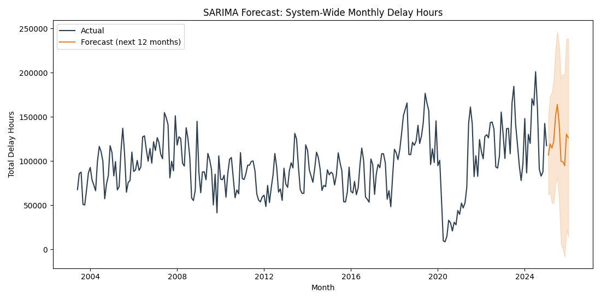
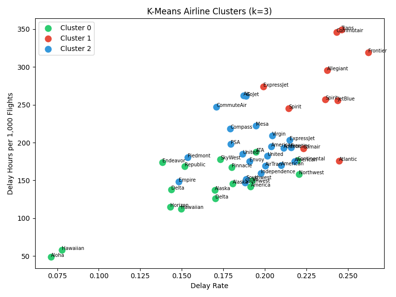

# U.S. Airline Delay Analysis: Trends, Causes & Forecasting

Analysis of 398,233 monthly airline-airport records (2003–2025) from the U.S. Bureau of
Transportation Statistics to explain when, where, and why U.S. flights get delayed — and to
build models that forecast delay volume, group airlines by operational risk, and flag
high-delay conditions ahead of time.

## Business Problem

Airlines and airports lose money and customer trust every time flights run late, and late
aircraft, weather, and air-traffic congestion don't contribute equally or consistently across
the year. Without a system-wide view of *when* delays spike, *which* carriers and airports
drive them, and *what* causes dominate, staffing, gate allocation, and schedule buffers get set
reactively instead of ahead of the problem. This project turns 22 years of BTS delay-cause
data into a set of concrete, testable answers to that problem.

## Objectives

- Quantify how delay rates move across months and years, and isolate the seasonal pattern from the noise.
- Rank airlines and airports by delay severity using volume-adjusted metrics (not raw totals, which just reward small carriers).
- Break total delay minutes down by cause (carrier, weather, NAS, security, late-aircraft) and see how that mix shifts by month.
- Forecast next year's system-wide delay hours with a time-series model.
- Segment airlines into operational-performance clusters.
- Predict, ahead of time, whether a carrier-airport pair is heading into a high-delay period — using only information that would actually be available in advance.

## Dataset

| | |
|---|---|
| Source | U.S. Bureau of Transportation Statistics, "Airline Delay Cause" (accessed via Kaggle: *Airline On-Time Statistics and Delay Causes*) |
| Size | 398,233 rows × 21 columns |
| Grain | One row per carrier–airport–month |
| Time range | 2003–2025 |
| Key fields | `arr_flights`, `arr_del15` (flights delayed 15+ min), `carrier_ct`/`weather_ct`/`nas_ct`/`security_ct`/`late_aircraft_ct` (delay counts by cause), corresponding `*_delay` minute fields, `arr_cancelled`, `arr_diverted` |

Full column dictionary in [`documentation/data_dictionary.md`](documentation/data_dictionary.md).
Raw file isn't committed to the repo (51 MB) — see [`data/raw/README.md`](data/raw/README.md) for the download link and instructions to regenerate everything below from scratch.

## Methodology

**1. Cleaning** (`notebooks/01_data_cleaning_and_eda.ipynb`, `scripts/01_clean_data.py`) — coerced all delay/count fields to numeric, filled and clipped invalid/negative values at zero, capped the small number of extreme delay-minute outliers at the 99th percentile so a handful of records didn't distort the aggregates, and built a proper monthly time index.

**2. Feature engineering** — `delay_rate` (delayed / total arrivals), `cancellation_rate`, `total_delay_minutes`, `delay_hours`, `avg_delay_per_delayed_flight`, and a continuous `month_ts` timestamp for time-series work.

**3. Exploratory analysis** (`scripts/02_eda.py`) — distribution of delay minutes, system-wide monthly delay-rate trend, yearly delay-hour totals, top airlines/airports by volume-adjusted delay, and the monthly mix of delay causes.

**4. Modeling:**
- **SARIMA(1,1,1)(1,1,1,12)** on system-wide monthly delay hours, evaluated on a held-out final 12 months (`scripts/03_sarima_forecast.py`).
- **K-Means (k=3)**, selected via the elbow method, clustering the 49 highest-volume carriers on delay rate, cancellation rate, late-aircraft share, and delay-hours per 1,000 flights (`scripts/04_kmeans_clustering.py`).
- **Logistic Regression** predicting whether a carrier-airport-month will be a "high delay" period (`delay_rate ≥ 0.25`), using only information available in advance: carrier identity, month, flight volume, and the *prior* month's delay/cancellation rate for that carrier-airport pair (`scripts/05_classification.py`).

## A Modeling Correction Worth Calling Out

An earlier version of this analysis (built for a class project) reported a Logistic Regression
with AUC = 1.00 and 99.4% accuracy for the same high-delay classification task. That result
was **target leakage**, not a good model: the feature set included `total_delay_minutes` and
the cause-count columns (`carrier_ct`, `weather_ct`, `nas_ct`, `late_aircraft_ct`), which are
the literal arithmetic components used to compute `delay_rate` — the same value the label is
thresholded on. The model wasn't predicting delays, it was re-deriving the label from itself.

The version in this repo removes every feature that overlaps with the label's own definition
and replaces same-period totals with genuinely prior information (lagged delay rate, carrier,
month, volume). The honest result is **73.3% accuracy, AUC 0.798** — lower, but the number
means something and would survive a technical interview question about it.

## Key Findings

| Question | Finding |
|---|---|
| Overall delay rate | 19.2% of flights arrive 15+ minutes late system-wide across the full period |
| Seasonality | Delay rates peak every June–July and again in December; both align with peak travel volume, not just weather |
| Dominant causes | Late-aircraft delay (39.3%) and carrier-controlled delay (32.3%) together account for over 70% of total delay minutes — weather is only 5.1% |
| Highest-delay carriers | Regional carriers built around connecting hub schedules (CommuteAir, Trans States, Air Wisconsin, GoJet) show the highest average minutes per delayed flight — consistent with delay-propagation through tight regional schedules |
| Highest-delay airports | Smaller regional airports with limited schedule padding (e.g. Macon GA, Aguadilla PR) show the highest delay *rates*, not the largest hubs |
| Forecasting | SARIMA forecasts next-12-month system delay hours with a hold-out MAE of ~15.4% of the test period's mean |
| Airline segmentation | K-Means splits 49 major carriers into three groups: a low-delay group (17 carriers, ~16% delay rate), a mid-tier group (22 carriers, ~19% delay rate), and a high-delay group (10 carriers, ~24% delay rate and disproportionately more cancellations) |
| High-delay prediction | A carrier's own delay/cancellation performance the prior month is the strongest available signal for whether the next month will be a high-delay period |


*12-month SARIMA forecast of system-wide delay hours, with confidence interval.*


*Airlines segmented into three operational-performance clusters.*

## Visualizations

All charts in [`visualizations/`](visualizations/), generated directly from the scripts above:

| File | Chart |
|---|---|
| `01_delay_distribution.png` | Distribution of arrival delay minutes |
| `02_monthly_delay_rate_trend.png` | System-wide monthly delay rate, 2003–2025 |
| `03_delay_hours_by_year.png` | Total delay hours by year |
| `04_top10_airlines_avg_delay.png` | Top 10 airlines by avg. delay per delayed flight |
| `05_top10_airports_delay_rate.png` | Top 10 airports by delay rate |
| `06_delay_causes_by_month.png` | Monthly mix of delay causes (stacked share) |
| `07_sarima_forecast.png` | SARIMA 12-month forecast with confidence interval |
| `08_kmeans_elbow.png` | Elbow plot used to select k=3 |
| `09_kmeans_clusters.png` | Airline clusters (delay rate vs. delay hours/1K flights) |
| `10_logreg_results_corrected.png` | Confusion matrix + ROC curve, leakage-free model |

*(Suggested: add a short screen recording or GIF of the SARIMA/cluster charts if you want a preview image at the top of this README.)*

## Technologies Used

Python (pandas, numpy), matplotlib, seaborn, scikit-learn (StandardScaler, KMeans, LogisticRegression, train/test split, metrics), statsmodels (SARIMAX), Jupyter.

## Repository Structure

```
airline-delay-analytics/
├── README.md
├── LICENSE
├── .gitignore
├── requirements.txt
├── data/
│   ├── raw/                 # download instructions (file not committed, 51MB)
│   └── cleaned/              # small aggregated outputs (monthly summary, cluster table)
├── notebooks/
│   └── 01_data_cleaning_and_eda.ipynb
├── scripts/
│   ├── 01_clean_data.py
│   ├── 02_eda.py
│   ├── 03_sarima_forecast.py
│   ├── 04_kmeans_clustering.py
│   └── 05_classification.py
├── visualizations/
└── documentation/
    └── data_dictionary.md
```

## How to Run

```bash
git clone <repo-url>
cd airline-delay-analytics
pip install -r requirements.txt

# 1. Download Airline_Delay_Cause.csv into data/raw/ (see data/raw/README.md)
python scripts/01_clean_data.py        # -> data/cleaned/airline_delay_cleaned.csv
python scripts/02_eda.py               # -> visualizations/01-06
python scripts/03_sarima_forecast.py   # -> visualizations/07
python scripts/04_kmeans_clustering.py # -> visualizations/08-09, data/cleaned/airline_clusters.csv
python scripts/05_classification.py    # -> visualizations/10
```

## Future Improvements

- Bring in weather API data to separate true weather-driven delay from schedule-driven late-aircraft delay.
- Add an airport congestion/traffic-density index as a classification feature.
- Extend SARIMA to a per-carrier or per-hub forecast instead of a single system-wide series.
- Try gradient-boosted trees for the classification task now that the leakage is fixed — logistic regression is a reasonable baseline, not necessarily the ceiling.

## Challenges & How They Were Solved

- **2020–2021 volume collapse** distorted both the SARIMA seasonal parameters and raw yearly comparisons. Addressed by keeping the anomaly visible in the plotted series (transparency) while documenting it explicitly as a known distortion in the forecast discussion.
- **Extreme outlier delay-minute values** skewed averages and produced unstable early clustering attempts. Capping at the 99th percentile (instead of dropping rows) preserved distribution shape without losing carriers entirely.
- **Target leakage in the original classification model** — see the correction section above. This is the most important lesson in the whole project: a perfect model score is a bug report, not a result.

## Limitations

- Delay *cause* attribution in BTS data is self-reported by carriers, not independently audited — cross-carrier comparisons should be read with that in mind.
- SARIMA is fit on a single national aggregate; it will not capture carrier- or hub-specific seasonal shocks (e.g. a single airline's schedule change).
- The classification model's positive class ("high delay") is a threshold definition (`delay_rate ≥ 0.25`), not an externally validated business definition of "bad" performance.

---
*Originally developed as a team project for AIT 664 (George Mason University); this repository contains the data cleaning and EDA code as originally written, plus an independently rebuilt and corrected modeling layer (SARIMA, K-Means, Logistic Regression).*
